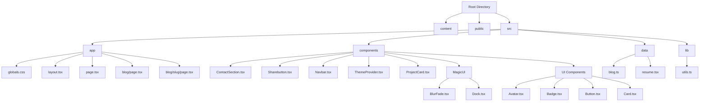

# 🚀 K Rajtilak's Portfolio (V4)  

[](https://krajtilak.vercel.app)  [](https://nextjs.org/)  [](https://ui.shadcn.com/)  [](https://magicui.design/)  [](https://vercel.com/)  

🎯 **A high-performance, visually appealing, and feature-rich portfolio website showcasing my skills, projects, and achievements. Built with modern web technologies, optimized for responsiveness, and deployed on Vercel.**  

---

## 🏗️ Tech Stack  
| **Category**     | **Technology Used** |
|-----------------|---------------------|
| **Framework**    | Next.js 14 |
| **UI Framework** | ShadCN/UI, Magic UI |
| **Styling**      | Tailwind CSS, PostCSS |
| **Markdown Handling** | MDX |
| **Package Manager** | PNPM |
| **Deployment**   | Vercel |

---

## 📌 Features  
✅ **Modern UI** – Aesthetic and responsive design powered by **ShadCN/UI & Magic UI**.  
✅ **Optimized Performance** – Built with **Next.js 14** for blazing-fast performance.  
✅ **Dynamic Blog System** – Supports **.mdx** files for seamless content management.  
✅ **Dark Mode** – Integrated with ShadCN's theme toggle.  
✅ **Social Links** – GitHub, LinkedIn, Twitter, and Instagram embedded.  
✅ **Fast & Secure Deployment** – Hosted on **Vercel** with optimized configurations.  
✅ **Custom Animations** – Smooth UI/UX using **Magic UI animations**.  
✅ **Reusable Components** – Well-structured component library for scalability.  

---

## 🏛️ Project Structure  



---

## 📂 Directory Overview  

- **`content/`** – Stores `.mdx` blog posts.  
- **`public/`** – Static assets (images, icons, etc.).  
- **`src/app/`** – Main application logic and routing.  
- **`src/components/`** – Modular UI components.  
- **`src/data/`** – Data files for blog and resume.  
- **`src/lib/`** – Utility functions.  
- **`tailwind.config.ts`** – Tailwind CSS configuration.  
- **`next.config.mjs`** – Next.js configuration.  

---

## 📦 Installation & Setup  

1️⃣ **Clone the Repository**  
```bash
git clone https://github.com/rajtilak-2020/K-Rajtilak_s-Portfolio-V4.git
cd K-Rajtilak_s-Portfolio-V4
```

2️⃣ **Install Dependencies**  
```bash
pnpm install
```

3️⃣ **Run the Development Server**  
```bash
npm run dev
```
🔹 Open [localhost:3000](http://localhost:3000) in your browser.

---

## 🖼️ Screenshots  

| **Dark Mode** | **Light Mode** |
|---------------|--------------|
|  |  |

---

## 🔗 Live Preview  

<div align="center">

</div>

🔹 [Visit Live Website](https://krajtilak.vercel.app)  

---

## 📜 License  
This project is licensed under the **MIT License** – feel free to use and modify.   

---

# Credits

- Special thanks to [Dillion Verma](https://github.com/dillionverma/portfolio) for his base template!

---

## 📞 Contact  
📩 **Email:** [Click Here](mailto:rajtilak1062020@gmail.com)  
🔗 **GitHub:** [Click Here](https://github.com/rajtilak-2020)  
🔗 **LinkedIn:** [Click Here](www.linkedin.com/in/krajtilak2020)  

---

### 🌟 If you like this project, don't forget to star ⭐ it on GitHub!  

---
