# 🌐 K Rajtilak's Portfolio V4

[](https://krajtilak.vercel.app)  
[](https://nextjs.org/)  
[](https://ui.shadcn.com/)  
[](https://magicui.design/)  
[](https://vercel.com/)  
[](./LICENSE)
[](https://www.typescriptlang.org/)
[](https://tailwindcss.com/)

## 📖 Overview

🎯 **A high-performance, visually appealing, and feature-rich portfolio website showcasing my skills, projects, and achievements. Built with modern web technologies, optimized for responsiveness, and deployed on Vercel.**

This portfolio represents the fourth iteration of my personal website, featuring a modern design system, optimized performance, and seamless user experience. It serves as a comprehensive showcase of my technical expertise, projects, and professional journey.

---

## 🏗️ Tech Stack

| **Category**         | **Technology Used**                    | **Version** |
|---------------------|---------------------------------------|-------------|
| **Framework**        | Next.js                               | 14.x        |
| **Language**         | TypeScript                            | 5.x         |
| **UI Framework**     | ShadCN/UI, Magic UI                   | Latest      |
| **Styling**          | Tailwind CSS, PostCSS                | 3.x         |
| **Content**          | MDX                                   | Latest      |
| **Package Manager**  | PNPM                                  | Latest      |
| **Deployment**       | Vercel                                | Latest      |
| **Version Control**  | Git & GitHub                          | Latest      |

---

## 📌 Features

### Core Features
- **Modern UI Design** – Aesthetic and responsive design powered by ShadCN/UI & Magic UI
- **Optimized Performance** – Built with Next.js 14 for blazing-fast performance and SEO optimization
- **Dynamic Blog System** – Supports .mdx files for seamless content management with syntax highlighting
- **Theme System** – Integrated dark/light mode with ShadCN's theme toggle
- **Social Integration** – GitHub, LinkedIn, Twitter, and Instagram embedded with smooth animations
- **Fast & Secure Deployment** – Hosted on Vercel with optimized configurations and CDN
- **Custom Animations** – Smooth UI/UX using Magic UI animations and Framer Motion
- **Reusable Components** – Well-structured component library for scalability and maintainability

### Advanced Features
- **TypeScript Support** – Full TypeScript integration for type safety and better development experience
- **Responsive Design** – Mobile-first approach with seamless experience across all devices
- **SEO Optimized** – Meta tags, structured data, and performance optimizations
- **Progressive Web App** – Service worker integration for offline functionality
- **Analytics Ready** – Google Analytics and performance monitoring integration
- **Accessibility** – WCAG 2.1 AA compliant with proper ARIA labels and keyboard navigation

---

## 🏛️ Project Structure

```mermaid
graph TD;
    A[Root Directory] --> B[content] 
    A --> C[public] 
    A --> D[src] 
    A --> E[Configuration Files]

    B --> B1[blog posts]
    B --> B2[projects]

    C --> C1[images]
    C --> C2[icons]
    C --> C3[favicon]
    C --> C4[preview.gif]

    D --> D1[app] 
    D --> D2[components] 
    D --> D3[data] 
    D --> D4[lib] 
    D --> D5[types]
    D --> D6[hooks]

    D1 --> D1a[globals.css]
    D1 --> D1b[layout.tsx]
    D1 --> D1c[page.tsx]
    D1 --> D1d[blog/page.tsx]
    D1 --> D1e[blog/slug/page.tsx]
    D1 --> D1f[projects/page.tsx]
    D1 --> D1g[about/page.tsx]

    D2 --> D2a[ContactSection.tsx]
    D2 --> D2b[Sharebutton.tsx]
    D2 --> D2c[Navbar.tsx]
    D2 --> D2d[ThemeProvider.tsx]
    D2 --> D2e[ProjectCard.tsx]
    D2 --> D2f[Footer.tsx]
    D2 --> D2g[Hero.tsx]
    
    D2 --> D2h[MagicUI]
    D2h --> D2h1[BlurFade.tsx]
    D2h --> D2h2[Dock.tsx]
    D2h --> D2h3[AnimatedText.tsx]

    D2 --> D2i[UI Components]
    D2i --> D2i1[Avatar.tsx]
    D2i --> D2i2[Badge.tsx]
    D2i --> D2i3[Button.tsx]
    D2i --> D2i4[Card.tsx]
    D2i --> D2i5[Dialog.tsx]

    D3 --> D3a[blog.ts]
    D3 --> D3b[resume.tsx]
    D3 --> D3c[projects.ts]
    D3 --> D3d[skills.ts]

    D4 --> D4a[utils.ts]
    D4 --> D4b[mdx.ts]
    D4 --> D4c[analytics.ts]

    E --> E1[next.config.mjs]
    E --> E2[tailwind.config.ts]
    E --> E3[tsconfig.json]
    E --> E4[package.json]
    E --> E5[.env.example]
```



---

## 📂 Directory Overview

### Main Directories
- **`content/`** – Stores .mdx blog posts and project documentation
- **`public/`** – Static assets including images, videos, and preview
- **`src/app/`** – Main application logic, routing, and page components
- **`src/components/`** – Modular UI components organized by functionality
- **`src/data/`** – Data files for blog, resume and projects
- **`src/lib/`** – Utility functions and helper modules


### Configuration Files
- **`tailwind.config.ts`** – Tailwind CSS configuration with custom theme
- **`next.config.mjs`** – Next.js configuration with optimizations
- **`tsconfig.json`** – TypeScript configuration
- **`package.json`** – Project dependencies and scripts

---

## 📦 Installation & Setup

### Prerequisites
- Node.js (v18 or higher)
- PNPM (recommended) or npm
- Git

### Quick Start

1️⃣ **Clone the Repository**
```bash
git clone https://github.com/rajtilak-2020/K-Rajtilak_s-Portfolio-V4.git
cd K-Rajtilak_s-Portfolio-V4
```

2️⃣ **Install Dependencies**
```bash
pnpm install
# or
npm install
```

3️⃣ **Environment Setup**
```bash
cp .env.example .env.local
# Edit .env.local with your configuration
```

4️⃣ **Run the Development Server**
```bash
pnpm dev
# or
npm run dev
```

5️⃣ **Open in Browser**

🔹 Navigate to [localhost:3000](http://localhost:3000) in your browser

### Available Scripts

| Script | Description |
|--------|-------------|
| `pnpm dev` | Start development server |
| `pnpm build` | Build for production |
| `pnpm start` | Start production server |
| `pnpm lint` | Run ESLint |
| `pnpm type-check` | Run TypeScript type checking |

---

## 🚀 Deployment

### Vercel Deployment (Recommended)

1. Connect your GitHub repository to Vercel
2. Configure environment variables in Vercel dashboard
3. Deploy automatically on every push to main branch

### Manual Deployment

```bash
# Build the project
pnpm build

# Start production server
pnpm start
```

### Environment Variables

Create a `.env.local` file with the following variables:

```env
NEXT_PUBLIC_SITE_URL=https://your-domain.com
NEXT_PUBLIC_ANALYTICS_ID=your-analytics-id
```

---

## 🖼️ Screenshots

| **Dark Mode** | **Light Mode** |
|---------------|--------------|
|  |  |

---

## 🛠️ Customization

### Adding New Content

#### Blog Posts
1. Create a new `.mdx` file in the `content/` directory
2. Add frontmatter with metadata
3. Write your content using MDX syntax

#### Projects
1. Update `src/data/project-cards.tsx` with project information
2. Add project images to `/public`
3. Optionally create detailed project pages

### Styling
- Modify `tailwind.config.ts` for custom theme colors
- Update component styles in respective component files
- Add custom CSS in `src/app/globals.css`

### Configuration
- Update site metadata in `src/app/layout.tsx`
- Modify navigation in `src/components/navbar.tsx`

---

## 🧪 Testing

### Running Tests
```bash
# Run unit tests
pnpm test

# Run e2e tests
pnpm test:e2e

# Run tests with coverage
pnpm test:coverage
```

### Performance Testing
```bash
# Lighthouse audit
pnpm lighthouse

# Bundle analyzer
pnpm analyze
```

---

## 📈 Performance Optimizations

- **Code Splitting** – Automatic code splitting with Next.js
- **Image Optimization** – Next.js Image component with WebP support
- **Bundle Size** – Optimized bundle size with tree shaking
- **Caching** – Strategic caching with Vercel Edge Network
- **Core Web Vitals** – Optimized for Google's Core Web Vitals

---

## 🔧 Contributing

### Development Workflow

1. Fork the repository
2. Create a feature branch (`git checkout -b feature/amazing-feature`)
3. Make your changes
4. Run tests and linting
5. Commit your changes (`git commit -m 'Add some amazing feature'`)
6. Push to the branch (`git push origin feature/amazing-feature`)
7. Open a Pull Request

### Code Style

- Follow TypeScript best practices
- Use Prettier for code formatting
- Follow component naming conventions
- Write meaningful commit messages

---

## 📚 Documentation

### API Reference
- [Next.js Documentation](https://nextjs.org/docs)
- [ShadCN/UI Documentation](https://ui.shadcn.com/)
- [Magic UI Documentation](https://magicui.design/)
- [Tailwind CSS Documentation](https://tailwindcss.com/docs)

### Tutorials
- [Getting Started with Next.js](https://nextjs.org/learn)
- [MDX Documentation](https://mdxjs.com/)
- [Vercel Deployment Guide](https://vercel.com/docs)

---

## 🐛 Troubleshooting

### Common Issues

**Build Errors**
```bash
# Clear cache and reinstall dependencies
rm -rf .next node_modules
pnpm install
```

**TypeScript Errors**
```bash
# Run type checking
pnpm type-check
```

**Styling Issues**
```bash
# Rebuild Tailwind CSS
pnpm build:css
```

---

## 📊 Analytics & Monitoring

- **Google Analytics** – Traffic and user behavior tracking
- **Vercel Analytics** – Performance monitoring
- **Core Web Vitals** – Real user monitoring
- **Error Tracking** – Sentry integration for error monitoring

---

## 🔒 Security

- **Content Security Policy** – Implemented for XSS protection
- **HTTPS** – SSL/TLS encryption via Vercel
- **Environment Variables** – Secure configuration management
- **Dependencies** – Regular security audits with npm audit

---

## 📜 License

This project is licensed under the **MIT License** – feel free to use and modify.

See the [LICENSE](./LICENSE) file for details.

---

## 🙏 Credits

- Special thanks to [Dillion Verma](https://github.com/dillionverma/) for his base template!
- Icons by [Lucide](https://lucide.dev/)
- Animations by [Magic UI](https://magicui.design/)
- UI Components by [ShadCN/UI](https://ui.shadcn.com/)

---

## 📞 Contact

📩 **Email:** [rajtilak1062020@gmail.com](mailto:rajtilak1062020@gmail.com)  
🔗 **GitHub:** [rajtilak-2020](https://github.com/rajtilak-2020)  
🔗 **LinkedIn:** [krajtilak2020](https://www.linkedin.com/in/krajtilak2020)  
🌐 **Portfolio:** [krajtilak.vercel.app](https://krajtilak.vercel.app)

---

## 💝 Support

If you found this project helpful, please consider:

- ⭐ Starring the repository
- 🐛 Reporting bugs
- 💡 Suggesting new features
- 🔗 Sharing with others

---

### 🌟 If you like this project, don't forget to star ⭐ it on GitHub!

---

<div align="center">
  <p>Made with ❤️ by K Rajtilak</p>
  <p>© 2025 K Rajtilak. All rights reserved.</p>
</div>
