<div align="center">
    


**A cutting-edge, high-performance portfolio showcasing modern web development excellence**

[](https://krajtilak.vercel.app)
[](https://nextjs.org/)
[](https://www.typescriptlang.org/)
[](https://tailwindcss.com/)

[](https://github.com/rajtilak-2020/K-Rajtilak_s-Portfolio-V4/actions)
[](./LICENSE)
[](https://github.com/rajtilak-2020/K-Rajtilak_s-Portfolio-V4/stargazers)
[](https://github.com/rajtilak-2020/K-Rajtilak_s-Portfolio-V4/network)

</div>

---

## 🎯 Overview

> **A modern, performant, and visually stunning portfolio website that represents the pinnacle of contemporary web development.**

This is the **fourth iteration** of my personal portfolio, built from the ground up with modern web technologies and best practices. It showcases my journey as a developer through an elegant, responsive, and highly optimized user experience.

### 🌟 What Makes This Special

- 🎨 **Modern Design Language** - Clean, minimal, and accessible design with smooth animations
- ⚡ **Lightning Fast** - Optimized for Core Web Vitals with 95+ Lighthouse scores
- 📱 **Fully Responsive** - Seamless experience across all devices and screen sizes
- 🌙 **Smart Theming** - Intelligent dark/light mode with system preference detection
- 📝 **Dynamic Content** - MDX-powered blog with syntax highlighting and interactive elements
- 🔍 **SEO Optimized** - Complete meta tags, structured data, and social sharing


## ✨ Key Features

<details>
<summary><b>🎨 User Experience Features</b></summary>

- **Immersive Hero Section** with animated text and dynamic backgrounds
- **Interactive Navigation** with smooth scrolling and active section highlighting  
- **Project Showcase** with live previews, GitHub integration, and detailed case studies
- **Skills Visualization** with animated progress bars and technology icons
- **Contact Integration** with social links and direct messaging capabilities
- **Blog System** with category filtering, search, and reading time estimates

</details>

<details>
<summary><b>⚡ Performance Features</b></summary>

- **Code Splitting** - Automatic route-based and component-based splitting
- **Image Optimization** - Next.js Image component with WebP/AVIF support
- **Lazy Loading** - Progressive content loading for improved initial load times
- **Bundle Analysis** - Optimized bundle sizes with tree-shaking
- **Caching Strategy** - Strategic caching with Vercel Edge Network
- **Core Web Vitals** - Optimized for Google's performance metrics

</details>

<details>
<summary><b>🔧 Developer Features</b></summary>

- **TypeScript Integration** - Full type safety with strict configuration
- **Component Library** - Reusable UI components with ShadCN/UI
- **Animation System** - Magic UI and Framer Motion for smooth interactions
- **Content Management** - MDX support for rich content creation
- **Development Tools** - ESLint, Prettier, and comprehensive testing setup
- **CI/CD Pipeline** - Automated testing, building, and deployment

</details>

## 🏗️ System Architecture

```mermaid
graph TB
    subgraph "Client Layer"
        A[🌐 Browser] --> B[⚡ Next.js App Router]
        B --> C[🎨 React Components]
        C --> D[💫 Magic UI Animations]
        D --> E[🎭 ShadCN/UI Components]
    end
    
    subgraph "Application Core"
        B --> F[📱 Page Components]
        F --> G[🧩 Reusable Components]
        G --> H[📊 Data Layer]
        H --> I[🔄 State Management]
        I --> J[🎯 Business Logic]
    end
    
    subgraph "Content Management"
        K[📝 MDX Content] --> L[🔍 Content Parser]
        L --> M[✨ Syntax Highlighter]
        M --> N[📖 Blog System]
        N --> F
    end
    
    subgraph "Styling System"
        O[🎨 Tailwind CSS] --> P[🌙 Theme Provider]
        P --> Q[💡 Design Tokens]
        Q --> R[📐 Responsive Utilities]
        R --> E
    end
    
    subgraph "Build & Optimization"
        S[⚙️ Next.js Compiler] --> T[📦 Webpack Bundle]
        T --> U[🗜️ Code Splitting]
        U --> V[🖼️ Image Optimization]
        V --> W[💨 Static Generation]
    end
    
    subgraph "Deployment & CDN"
        W --> X[🚀 Vercel Platform]
        X --> Y[🌍 Edge Network]
        Y --> Z[📈 Analytics & Monitoring]
        Z --> A
    end
    
    subgraph "External Integrations"
        AA[📧 Email Service] --> F
        BB[🐙 GitHub API] --> H
        CC[📊 Analytics APIs] --> Z
        DD[🎯 SEO Tools] --> B
    end

    classDef clientLayer fill:#e1f5fe,stroke:#0288d1,stroke-width:2px,color:#01579b
    classDef appCore fill:#f3e5f5,stroke:#7b1fa2,stroke-width:2px,color:#4a148c
    classDef content fill:#e8f5e8,stroke:#388e3c,stroke-width:2px,color:#1b5e20
    classDef styling fill:#fff3e0,stroke:#f57c00,stroke-width:2px,color:#e65100
    classDef build fill:#fce4ec,stroke:#c2185b,stroke-width:2px,color:#880e4f
    classDef deploy fill:#f1f8e9,stroke:#689f38,stroke-width:2px,color:#33691e
    classDef external fill:#f5f5f5,stroke:#616161,stroke-width:2px,color:#212121

    class A,B,C,D,E clientLayer
    class F,G,H,I,J appCore
    class K,L,M,N content
    class O,P,Q,R styling
    class S,T,U,V,W build
    class X,Y,Z deploy
    class AA,BB,CC,DD external
```



### 🔄 Data Flow Architecture

```mermaid
sequenceDiagram
    participant User as 👤 User
    participant Browser as 🌐 Browser
    participant NextJS as ⚡ Next.js
    participant Components as 🧩 Components
    participant Data as 📊 Data Layer
    participant CMS as 📝 Content
    participant CDN as 🌍 Vercel CDN

    User->>Browser: Visit Portfolio
    Browser->>NextJS: Request Page
    NextJS->>Data: Fetch Static Data
    NextJS->>CMS: Parse MDX Content
    NextJS->>Components: Hydrate Components
    Components->>Browser: Render UI
    Browser->>CDN: Load Assets
    CDN->>Browser: Optimized Assets
    Browser->>User: Display Portfolio

    Note over User,CDN: Lightning Fast Experience ⚡
```



## 🔧 Technology Stack


### 🎯 Core Technologies

| Technology | Version | Purpose | Performance Impact |
|------------|---------|---------|-------------------|
| **Next.js** | 14.x | React Framework | App Router, SSG, Image Optimization |
| **TypeScript** | 5.x | Type Safety | Development Experience, Runtime Safety |
| **Tailwind CSS** | 3.x | Styling Framework | Utility-First, Minimal CSS Bundle |
| **ShadCN/UI** | Latest | Component Library | Consistent Design System |
| **Magic UI** | Latest | Animations | Smooth UX Interactions |

### 🛠️ Development Tools

| Tool | Purpose | Benefits |
|------|---------|----------|
| **PNPM** | Package Manager | Faster installs, Disk efficiency |
| **ESLint** | Code Linting | Code quality, Best practices |
| **Prettier** | Code Formatting | Consistent code style |
| **Husky** | Git Hooks | Pre-commit validation |

### 🚀 Deployment & Performance

| Service | Purpose | Impact |
|---------|---------|---------|
| **Vercel** | Hosting Platform | Edge deployment, Analytics |
| **Vercel Edge Network** | CDN | Global performance |
| **Next.js Analytics** | Performance Monitoring | Real user metrics |


## 🚀 Quick Start

### Prerequisites

```bash
# Required versions
Node.js >= 18.0.0
PNPM >= 8.0.0 (recommended)
Git >= 2.0.0
```

### One-Command Setup

```bash
# Clone and setup in one go
npx create-next-app@latest my-portfolio --example https://github.com/rajtilak-2020/K-Rajtilak_s-Portfolio-V4
cd my-portfolio && pnpm dev
```

### Manual Setup

<details>
<summary><b>📋 Step-by-step installation</b></summary>

```bash
# 1️⃣ Clone the repository
git clone https://github.com/rajtilak-2020/K-Rajtilak_s-Portfolio-V4.git
cd K-Rajtilak_s-Portfolio-V4

# 2️⃣ Install dependencies (PNPM recommended)
pnpm install
# or npm install

# 3️⃣ Create environment file
cp .env.example .env.local

# 4️⃣ Start development server
pnpm dev

# 5️⃣ Open in browser
# Navigate to http://localhost:3000
```

</details>

### 📋 Available Scripts

```bash
# Development
pnpm dev          # Start dev server with hot reload
pnpm dev:turbo    # Start dev server with Turbopack

# Building
pnpm build        # Production build
pnpm start        # Start production server
pnpm export       # Static export

# Code Quality
pnpm lint         # Run ESLint
pnpm lint:fix     # Fix linting issues
pnpm type-check   # TypeScript type checking
pnpm format       # Format code with Prettier

# Testing
pnpm test         # Run unit tests
pnpm test:watch   # Watch mode testing
pnpm test:e2e     # End-to-end testing

# Analysis
pnpm analyze      # Bundle size analysis
pnpm lighthouse   # Performance audit
```

## 📂 Project Structure

```mermaid
graph TD
    subgraph "📁 Root Directory"
        A[🏠 K-Rajtilak-Portfolio-V4]
    end
    
    subgraph "📋 Configuration"
        A --> B1[⚙️ next.config.mjs]
        A --> B2[🎨 tailwind.config.ts]
        A --> B3[📦 package.json]
        A --> B4[🔧 tsconfig.json]
        A --> B5[📝 .env.example]
    end
    
    subgraph "📁 Source Code"
        A --> C[💻 src/]
        C --> C1[📱 app/]
        C --> C2[🧩 components/]
        C --> C3[📊 data/]
        C --> C4[🔧 lib/]
        C --> C5[🎨 styles/]
    end
    
    subgraph "📱 App Router"
        C1 --> D1[📄 layout.tsx]
        C1 --> D2[🏠 page.tsx]
        C1 --> D3[📝 blog/]
        C1 --> D4[👤 about/]
        C1 --> D5[💼 projects/]
        D3 --> D3a[📄 slug/page.tsx]
    end
    
    subgraph "🧩 Components"
        C2 --> E1[✨ magic-ui/]
        C2 --> E2[🎭 ui/]
        C2 --> E3[📱 sections/]
        C2 --> E4[🗂️ layout/]
        
        E1 --> E1a[💫 blur-fade.tsx]
        E1 --> E1b[🚢 dock.tsx]
        E1 --> E1c[📝 animated-text.tsx]
        
        E2 --> E2a[🔘 button.tsx]
        E2 --> E2b[💳 card.tsx]
        E2 --> E2c[👤 avatar.tsx]
        
        E3 --> E3a[🎯 hero.tsx]
        E3 --> E3b[💼 projects.tsx]
        E3 --> E3c[🛠️ skills.tsx]
        
        E4 --> E4a[📍 navbar.tsx]
        E4 --> E4b[👣 footer.tsx]
    end
    
    subgraph "📊 Data Layer"
        C3 --> F1[📝 blog.ts]
        C3 --> F2[💼 projects.ts]
        C3 --> F3[📄 resume.ts]
        C3 --> F4[🛠️ skills.ts]
    end
    
    subgraph "📁 Content & Assets"
        A --> G[📄 content/]
        A --> H[🌍 public/]
        
        G --> G1[📝 blog/]
        G --> G2[💼 projects/]
        G1 --> G1a[📄 *.mdx files]
        
        H --> H1[🖼️ images/]
        H --> H2[🎨 icons/]
        H --> H3[📄 favicon/]
    end

    classDef config fill:#fff3e0,stroke:#f57c00,stroke-width:2px,color:#e65100
    classDef source fill:#e8f5e8,stroke:#388e3c,stroke-width:2px,color:#1b5e20
    classDef app fill:#e1f5fe,stroke:#0288d1,stroke-width:2px,color:#01579b
    classDef components fill:#f3e5f5,stroke:#7b1fa2,stroke-width:2px,color:#4a148c
    classDef data fill:#fce4ec,stroke:#c2185b,stroke-width:2px,color:#880e4f
    classDef content fill:#f1f8e9,stroke:#689f38,stroke-width:2px,color:#33691e

    class B1,B2,B3,B4,B5 config
    class C,C1,C2,C3,C4,C5 source
    class D1,D2,D3,D4,D5,D3a app
    class E1,E2,E3,E4,E1a,E1b,E1c,E2a,E2b,E2c,E3a,E3b,E3c,E4a,E4b components
    class F1,F2,F3,F4 data
    class G,H,G1,G2,G1a,H1,H2,H3 content
```



### 📋 Directory Details
```
K-Rajtilak-Portfolio-V4/
├── 📁 src/
│   ├── 📱 app/                    # Next.js App Router
│   │   ├── 📄 layout.tsx          # Root layout component
│   │   ├── 🏠 page.tsx            # Homepage
│   │   ├── 📝 blog/               # Blog pages
│   │   │   ├── 📄 page.tsx        # Blog listing
│   │   │   └── 📄 [slug]/         # Individual blog posts
│   │   ├── 👤 about/              # About page
│   │   └── 💼 projects/           # Projects showcase
│   │
│   ├── 🧩 components/             # Reusable components
│   │   ├── ✨ magic-ui/           # Magic UI components
│   │   │   ├── 💫 blur-fade.tsx
│   │   │   ├── 🚢 dock.tsx
│   │   │   └── 📝 animated-text.tsx
│   │   ├── 🎭 ui/                 # ShadCN UI components
│   │   │   ├── 🔘 button.tsx
│   │   │   ├── 💳 card.tsx
│   │   │   └── 👤 avatar.tsx
│   │   ├── 📱 sections/           # Page sections
│   │   │   ├── 🎯 hero.tsx
│   │   │   ├── 💼 projects.tsx
│   │   │   └── 🛠️ skills.tsx
│   │   └── 🗂️ layout/             # Layout components
│   │       ├── 📍 navbar.tsx
│   │       └── 👣 footer.tsx
│   │
│   ├── 📊 data/                   # Static data
│   │   ├── 📝 blog.ts             # Blog metadata
│   │   ├── 💼 projects.ts         # Project data
│   │   ├── 📄 resume.ts           # Resume information
│   │   └── 🛠️ skills.ts           # Skills data
│   │
│   ├── 🔧 lib/                    # Utility functions
│   │   ├── 🛠️ utils.ts            # Helper utilities
│   │   ├── 📝 mdx.ts              # MDX processing
│   │   └── 🎨 fonts.ts            # Font configurations
│   │
│   └── 🎨 styles/                 # Global styles
│       └── 🌍 globals.css         # Global CSS
│
├── 📄 content/                    # MDX content
│   ├── 📝 blog/                   # Blog posts
│   │   ├── 📄 first-post.mdx
│   │   └── 📄 second-post.mdx
│   └── 💼 projects/               # Project documentation
│
├── 🌍 public/                     # Static assets
│   ├── 🖼️ images/                 # Images
│   ├── 🎨 icons/                  # Icons and favicons
│   └── 📄 resume.pdf              # Resume file
│
└── ⚙️ Configuration Files
    ├── 📦 package.json            # Dependencies
    ├── ⚙️ next.config.mjs         # Next.js config
    ├── 🎨 tailwind.config.ts      # Tailwind config
    ├── 🔧 tsconfig.json           # TypeScript config
    └── 📝 .env.example            # Environment template
```

</details>

## 🎨 Design System

### 🎯 Design Principles

- **Minimalism** - Clean, uncluttered interfaces with purposeful whitespace
- **Consistency** - Unified design language across all components
- **Accessibility** - WCAG 2.1 AA compliant with proper contrast ratios
- **Performance** - Optimized for fast loading and smooth interactions

### 🌈 Color Palette

```css
/* Primary Colors */
--primary: 220 90% 56%;           /* Blue */
--primary-foreground: 220 90% 98%; 

/* Secondary Colors */
--secondary: 220 14.3% 95.9%;     /* Light Gray */
--secondary-foreground: 220 8.9% 46.1%;

/* Accent Colors */
--accent: 220 14.3% 95.9%;        /* Accent Blue */
--accent-foreground: 220 8.9% 46.1%;

/* Status Colors */
--destructive: 0 62.8% 30.6%;     /* Red for errors */
--success: 142 76% 36%;           /* Green for success */
--warning: 38 92% 50%;            /* Orange for warnings */
```

### 📐 Typography Scale

| Size | Usage | Font Weight |
|------|-------|------------|
| `text-4xl` | Headings | 700 (Bold) |
| `text-2xl` | Subheadings | 600 (Semi-bold) |
| `text-lg` | Body Large | 500 (Medium) |
| `text-base` | Body Text | 400 (Regular) |
| `text-sm` | Caption | 400 (Regular) |

## 📱 Screenshots

<div align="center">

### 🌙 Dark Mode Experience


### ☀️ Light Mode Experience  


### 📱 Mobile Responsiveness
<table>
<tr>
<td align="center">📱 Mobile</td>
<td align="center">💻 Tablet</td>
<td align="center">🖥️ Desktop</td>
</tr>
<tr>
<td></td>
<td></td>
<td></td>
</tr>
</table>

</div>

## ⚡ Performance

### 🏆 Lighthouse Scores

<div align="center">

| Metric | Score | Description |
|--------|-------|-------------|
| **Performance** | 98/100 | Fast loading and smooth interactions |
| **Accessibility** | 100/100 | WCAG 2.1 AA compliant |
| **Best Practices** | 100/100 | Modern web standards |
| **SEO** | 100/100 | Search engine optimized |

</div>

### 📊 Core Web Vitals

```mermaid
graph LR
    subgraph "⚡ Loading Performance"
        A[FCP: 1.2s] --> A1[✅ Good]
        B[LCP: 1.8s] --> B1[✅ Good] 
        C[FID: 50ms] --> C1[✅ Good]
        D[CLS: 0.05] --> D1[✅ Good]
    end
    
    subgraph "🎯 Optimization Targets"
        E[Images: WebP/AVIF]
        F[Code Splitting: Automatic]
        G[Bundle Size: < 200KB]
        H[Caching: Edge Network]
    end
    
    classDef good fill:#c6f6d5,stroke:#38a169,stroke-width:2px,color:#22543d
    classDef optimization fill:#e1f5fe,stroke:#0288d1,stroke-width:2px,color:#01579b
    
    class A1,B1,C1,D1 good
    class E,F,G,H optimization
```



### 🔧 Performance Optimizations

<details>
<summary><b>⚡ View detailed optimizations</b></summary>

#### 🖼️ Image Optimization
- **Next.js Image Component** - Automatic WebP/AVIF conversion
- **Lazy Loading** - Images load only when needed
- **Responsive Images** - Multiple sizes for different screen sizes
- **Placeholder Blur** - Smooth loading experience

#### 📦 Bundle Optimization  
- **Tree Shaking** - Remove unused code automatically
- **Code Splitting** - Load only necessary JavaScript
- **Dynamic Imports** - Reduce initial bundle size
- **Compression** - Gzip/Brotli compression

#### 🚀 Runtime Performance
- **Virtual Scrolling** - Efficient large list rendering
- **Memoization** - Prevent unnecessary re-renders
- **Service Worker** - Cache resources for offline access
- **Prefetching** - Load next pages in advance

</details>

## 🛠️ Development

### 🎯 Development Workflow

```mermaid
graph LR
    A[🚀 Initial Setup] --> B[📝 Create Feature Branch]
    B --> C[⚡ Add Component]
    C --> D[🧪 Write Tests]
    D --> E[📚 Update Docs]
    E --> F[🔄 Switch to Main]
    F --> G[🔗 Merge Feature]
    G --> H[🌐 Deploy to Vercel]

    %% Branch styling
    A --> I[📋 main branch]
    B --> J[🌿 feature branch]
    C --> J
    D --> J
    E --> J
    F --> I
    G --> I
    H --> I

    classDef mainBranch fill:#e6f7ff,color:#0066cc,stroke:#0052cc,stroke-width:3px,font-weight:bold
    classDef featureBranch fill:#f0f8e6,color:#2d5016,stroke:#52c41a,stroke-width:2px
    classDef commit fill:#fff2e6,color:#d46b08,stroke:#fa8c16,stroke-width:2px
    classDef deploy fill:#f6ffed,color:#389e0d,stroke:#52c41a,stroke-width:3px,font-weight:bold

    class I mainBranch
    class J featureBranch
    class A,C,D,E,G commit
    class B,F commit
    class H deploy
```



### 🧪 Testing Strategy

<details>
<summary><b>🔍 Testing Approach</b></summary>

#### Unit Testing
- **Jest** - JavaScript testing framework
- **React Testing Library** - Component testing utilities
- **Coverage Reports** - Maintain >80% code coverage

#### Integration Testing  
- **Playwright** - End-to-end testing
- **Visual Regression** - Screenshot comparisons
- **Performance Testing** - Lighthouse CI

#### Quality Assurance
- **ESLint** - Code quality and consistency  
- **Prettier** - Code formatting
- **Husky** - Pre-commit hooks
- **TypeScript** - Static type checking

</details>

### 🔧 Customization Guide

<details>
<summary><b>🎨 How to customize for your use</b></summary>

#### 1. Personal Information
```typescript
// src/data/resume.ts
export const RESUME = {
  name: "Your Name",
  title: "Your Title", 
  email: "your.email@example.com",
  // ... more personal data
}
```

#### 2. Projects Data
```typescript
// src/data/projects.ts  
export const PROJECTS = [
  {
    title: "Your Project",
    description: "Project description",
    technologies: ["Next.js", "TypeScript"],
    // ... project details
  }
]
```

#### 3. Styling Customization
```css
/* src/styles/globals.css */
:root {
  --your-custom-color: #your-hex-code;
  --your-custom-font: 'Your Font Family';
}
```

#### 4. Content Management
```mdx
<!-- content/blog/your-post.mdx -->
---
title: "Your Blog Post"
date: "2024-01-01"  
description: "Post description"
---

Your MDX content here...
```

</details>

## 📚 Documentation

### 📖 Resources & References

- **[Next.js Documentation](https://nextjs.org/docs)** - Framework documentation
- **[ShadCN/UI Components](https://ui.shadcn.com/)** - Component library
- **[Magic UI Documentation](https://magicui.design/)** - Animation components
- **[Tailwind CSS](https://tailwindcss.com/docs)** - Utility-first CSS
- **[MDX Documentation](https://mdxjs.com/)** - Markdown with JSX

### 🎓 Learning Resources

<details>
<summary><b>📚 Recommended tutorials and guides</b></summary>

#### Next.js Learning Path
- [Next.js Learn Course](https://nextjs.org/learn)
- [App Router Migration Guide](https://nextjs.org/docs/app/building-your-application/upgrading/app-router-migration)
- [Performance Optimization](https://nextjs.org/docs/app/building-your-application/optimizing)

#### Design System Resources
- [Building Design Systems](https://www.designbetter.co/design-systems-handbook)
- [Accessibility Guidelines](https://www.w3.org/WAI/WCAG21/quickref/)
- [Color Theory for Developers](https://www.smashingmagazine.com/2010/01/color-theory-for-designers-part-1-the-meaning-of-color/)

#### Performance Optimization
- [Web.dev Performance](https://web.dev/performance/)
- [Core Web Vitals](https://web.dev/vitals/)
- [Next.js Performance](https://nextjs.org/docs/app/building-your-application/optimizing/performance)

</details>

### 🔧 API Reference

<details>
<summary><b>📡 Component APIs and Props</b></summary>

#### Magic UI Components
```typescript
// BlurFade Component
<BlurFade delay={0.25} inView>
  <YourComponent />
</BlurFade>

// Dock Component  
<Dock direction="middle" className="your-styles">
  <DockIcon>...</DockIcon>
</Dock>
```

#### Custom Hooks
```typescript
// Theme Hook
const { theme, setTheme } = useTheme()

// MDX Hook
const { posts, getPost } = useMDX()
```

</details>

## 🤝 Contributing

We welcome contributions from the community! Here's how you can help make this portfolio even better.

### 🚀 How to Contribute

```mermaid
flowchart TD
    A[🍴 Fork Repository] --> B[🌟 Create Feature Branch]
    B --> C[💻 Make Changes]
    C --> D[🧪 Add Tests]
    D --> E[✅ Run Quality Checks]
    E --> F[📝 Commit Changes]
    F --> G[📤 Push to Branch]  
    G --> H[🔄 Create Pull Request]
    H --> I[👀 Code Review]
    I --> J{✅ Approved?}
    J -->|Yes| K[🎉 Merge to Main]
    J -->|No| L[🔄 Address Feedback]
    L --> I

    classDef process fill:#e1f5fe,stroke:#0288d1,stroke-width:2px,color:#01579b
    classDef decision fill:#fff3e0,stroke:#f57c00,stroke-width:2px,color:#e65100
    classDef success fill:#e8f5e8,stroke:#388e3c,stroke-width:2px,color:#1b5e20
    classDef feedback fill:#fce4ec,stroke:#c2185b,stroke-width:2px,color:#880e4f

    class A,B,C,D,E,F,G,H,I process
    class J decision  
    class K success
    class L feedback
```

### 📋 Contribution Guidelines

<details>
<summary><b>🎯 Areas where you can contribute</b></summary>

#### 🐛 Bug Fixes
- Report issues with detailed reproduction steps
- Fix existing bugs and improve stability
- Add error handling and edge cases

#### ✨ Feature Enhancements
- Improve existing components and functionality  
- Add new interactive elements
- Enhance accessibility features

#### 📚 Documentation
- Improve README and component documentation
- Add code examples and tutorials
- Create video guides and walkthroughs

#### 🎨 Design Improvements
- Enhance visual design and user experience
- Add new themes and color schemes
- Improve mobile responsiveness

#### ⚡ Performance Optimizations
- Reduce bundle size and improve loading times
- Optimize images and assets
- Implement advanced caching strategies

</details>

### 🔍 Development Standards

<details>
<summary><b>📝 Code quality requirements</b></summary>

#### Code Style
```bash
# Run linting
pnpm lint

# Format code
pnpm format

# Type checking
pnpm type-check
```

#### Commit Convention
```bash
# Use conventional commits
feat: add new component
fix: resolve navigation bug  
docs: update README
style: format code
refactor: restructure components
test: add unit tests
chore: update dependencies
```

#### Pull Request Template
- **Description**: Clear explanation of changes
- **Type**: Bug fix, feature, documentation, etc.
- **Testing**: How the changes were tested
- **Screenshots**: For UI changes
- **Breaking Changes**: Any breaking changes

</details>

### 🏆 Recognition

<details>
<summary><b>🌟 Contributor Hall of Fame</b></summary>

<!-- This will be populated as contributors join -->

| Contributor | Contributions | GitHub |
|-------------|---------------|--------|
| **K Rajtilak** | Creator & Maintainer | [@rajtilak-2020](https://github.com/rajtilak-2020) |
| *Your name here* | *Your contributions* | *Your GitHub* |

*Want to see your name here? Start contributing today!*

</details>

## 🔒 Security

### 🛡️ Security Measures

- **Content Security Policy (CSP)** - Prevents XSS attacks
- **HTTPS Everywhere** - All traffic encrypted via Vercel SSL
- **Dependency Scanning** - Automated vulnerability checks
- **Environment Variables** - Secure configuration management
- **Input Validation** - All user inputs properly sanitized

### 📋 Security Reporting

If you discover a security vulnerability, please send an email to [rajtilak1062020@gmail.com](mailto:rajtilak1062020@gmail.com). All security vulnerabilities will be promptly addressed.

## 📈 Analytics & Monitoring

### 📊 Performance Monitoring

<details>
<summary><b>🔍 Monitoring stack</b></summary>

#### Real User Monitoring (RUM)
- **Vercel Analytics** - Page views, user sessions
- **Core Web Vitals** - Performance metrics
- **Error Tracking** - JavaScript error monitoring
- **Uptime Monitoring** - 99.9% availability tracking

#### Development Analytics
- **Bundle Analyzer** - JavaScript bundle optimization
- **Lighthouse CI** - Automated performance testing  
- **TypeScript Compiler** - Build-time error detection
- **ESLint Reports** - Code quality metrics

</details>

### 📊 Traffic Analytics


## 🚀 Deployment

### 🌍 Deployment Options

<details>
<summary><b>⚡ Multiple deployment strategies</b></summary>

#### Vercel (Recommended)
```bash
# Install Vercel CLI
npm i -g vercel

# Deploy to Vercel
vercel --prod
```

#### Netlify
```bash
# Build the project
pnpm build

# Deploy to Netlify
netlify deploy --prod --dir=out
```

#### Docker
```dockerfile
# Dockerfile included in repo
docker build -t portfolio .
docker run -p 3000:3000 portfolio
```

#### Self-hosted
```bash
# Build for production
pnpm build

# Start production server
pnpm start
```

</details>

### ⚙️ Environment Configuration

<details>
<summary><b>🔧 Environment variables setup</b></summary>

```env
# .env.local template
NEXT_PUBLIC_SITE_URL=https://your-domain.com
NEXT_PUBLIC_SITE_NAME="Your Portfolio"
NEXT_PUBLIC_AUTHOR_NAME="Your Name"

# Analytics (Optional)
NEXT_PUBLIC_GA_ID=your-google-analytics-id
NEXT_PUBLIC_HOTJAR_ID=your-hotjar-id

# Contact Form (Optional) 
CONTACT_EMAIL=your-email@example.com
SMTP_HOST=your-smtp-host
SMTP_PORT=587

# Social Links
NEXT_PUBLIC_GITHUB_URL=https://github.com/yourusername
NEXT_PUBLIC_LINKEDIN_URL=https://linkedin.com/in/yourprofile
NEXT_PUBLIC_TWITTER_URL=https://twitter.com/yourusername
```

</details>

## 🔧 Troubleshooting

### 🚨 Common Issues & Solutions

<details>
<summary><b>🔍 Quick fixes for common problems</b></summary>

#### Build Errors
```bash
# Clear cache and reinstall
rm -rf .next node_modules package-lock.json
pnpm install

# Clear Vercel cache
vercel --prod --force
```

#### TypeScript Errors
```bash
# Run type checking
pnpm type-check

# Fix auto-fixable issues
pnpm lint:fix
```

#### Styling Issues
```bash
# Rebuild Tailwind
pnpm build:css

# Check Tailwind config
pnpm tailwindcss --help
```

#### Performance Issues
```bash
# Analyze bundle size
pnpm analyze

# Run Lighthouse audit
pnpm lighthouse
```

#### MDX Content Issues
```bash
# Validate MDX files
pnpm mdx:validate

# Check content structure
pnpm content:check
```

</details>

### 🔧 Debug Mode

<details>
<summary><b>🐛 Enable debug logging</b></summary>

```bash
# Enable Next.js debug mode
DEBUG=next* pnpm dev

# Enable Vercel debug mode
VERCEL_DEBUG=1 vercel dev

# View detailed build logs  
VERBOSE=1 pnpm build
```

</details>

## 📊 Project Statistics

<div align="center">

### 📈 Repository Stats


### 🔢 Codebase Metrics

| Metric | Value |
|--------|--------|
| **Lines of Code** | ~15,000+ |
| **Components** | 50+ |
| **Pages** | 10+ |
| **Blog Posts** | Dynamic |
| **Bundle Size** | < 200KB |
| **Dependencies** | < 50 |

</div>

## 🛣️ Roadmap

### 🎯 Upcoming Features


### 🎉 Version History

<details>
<summary><b>📋 Changelog and version history</b></summary>

#### Version 4.0.0 (Current)
- ✨ Complete rewrite with Next.js 14
- 🎨 New design system with ShadCN/UI
- ⚡ Performance optimizations
- 📱 Enhanced mobile experience
- 🌙 Improved dark mode

#### Version 3.0.0
- 🚀 Next.js 13 with App Router
- 💫 Magic UI integration
- 📝 MDX blog system
- 🎯 SEO improvements

#### Version 2.0.0  
- ⚛️ React 18 upgrade
- 🎨 Tailwind CSS integration
- 📱 Mobile-first design
- ⚡ Performance focus

#### Version 1.0.0
- 🎯 Initial release
- 📄 Static HTML/CSS/JS
- 🎨 Basic responsive design

</details>

## 💝 Acknowledgments

### 🙏 Special Thanks

**Inspiration & Resources**

- **[Dillion Verma](https://github.com/dillionverma/)** - Base template inspiration
- **[ShadCN](https://github.com/shadcn)** - Amazing component library  
- **[Magic UI Team](https://magicui.design/)** - Beautiful animations
- **[Vercel Team](https://vercel.com/)** - Excellent platform and tools
- **[Next.js Team](https://nextjs.org/)** - Outstanding React framework

</div>

### 🌟 Community

- **Open Source Community** - For the amazing tools and libraries
- **Design Community** - For inspiration and feedback
- **Developer Community** - For knowledge sharing and support

## 📄 License

<div align="center">

**MIT License**

```
Copyright (c) 2024 K Rajtilak

Permission is hereby granted, free of charge, to any person obtaining a copy
of this software and associated documentation files (the "Software"), to deal
in the Software without restriction, including without limitation the rights
to use, copy, modify, merge, publish, distribute, sublicense, and/or sell
copies of the Software, and to permit persons to whom the Software is
furnished to do so, subject to the following conditions:

The above copyright notice and this permission notice shall be included in all
copies or substantial portions of the Software.

THE SOFTWARE IS PROVIDED "AS IS", WITHOUT WARRANTY OF ANY KIND, EXPRESS OR
IMPLIED, INCLUDING BUT NOT LIMITED TO THE WARRANTIES OF MERCHANTABILITY,
FITNESS FOR A PARTICULAR PURPOSE AND NONINFRINGEMENT. IN NO EVENT SHALL THE
AUTHORS OR COPYRIGHT HOLDERS BE LIABLE FOR ANY CLAIM, DAMAGES OR OTHER
LIABILITY, WHETHER IN AN ACTION OF CONTRACT, TORT OR OTHERWISE, ARISING FROM,
OUT OF OR IN CONNECTION WITH THE SOFTWARE OR THE USE OR OTHER DEALINGS IN THE
SOFTWARE.
```

[📄 Full License](./LICENSE)

</div>

## 📞 Contact & Support

<div align="center">

### 🌐 Connect with Me

[](https://krajtilak.vercel.app)
[](https://github.com/rajtilak-2020)
[](https://www.linkedin.com/in/krajtilak2020)
[](mailto:rajtilak1062020@gmail.com)

</div>

### 💬 Get Support

- 🐛 **Bug Reports**: [GitHub Issues](https://github.com/rajtilak-2020/K-Rajtilak_s-Portfolio-V4/issues)
- 💡 **Feature Requests**: [GitHub Discussions](https://github.com/rajtilak-2020/K-Rajtilak_s-Portfolio-V4/discussions)
- ❓ **Questions**: [Email Support](mailto:rajtilak1062020@gmail.com)
- 📚 **Documentation**: [GitHub Wiki](https://github.com/rajtilak-2020/K-Rajtilak_s-Portfolio-V4/wiki)

### 🤝 Community

Join our growing community of developers and creators!

- 🌟 **Star this repo** if you find it useful
- 🍴 **Fork and customize** for your own portfolio
- 📢 **Share with others** who might benefit
- 🤝 **Contribute** to make it even better


---

<div align="center">

## 🎉 Thank You!

**Thank you for checking out my portfolio project!**

This portfolio represents my journey as a developer and my passion for creating beautiful, performant web experiences. Whether you're here to learn, contribute, or just browse, I appreciate your time and interest.
</div>

### 🚀 Ready to build your own portfolio?

Feel free to fork this repository and make it your own. Don't forget to:
- ⭐ Star the repo if you found it helpful
- 🔄 Share it with your network  
- 🤝 Contribute improvements back to the community

---

### 💫 *"Code is poetry, and every portfolio tells a story"*

**Happy coding! 🚀**

*Made with ❤️, ☕, and countless hours of debugging*


</div>
